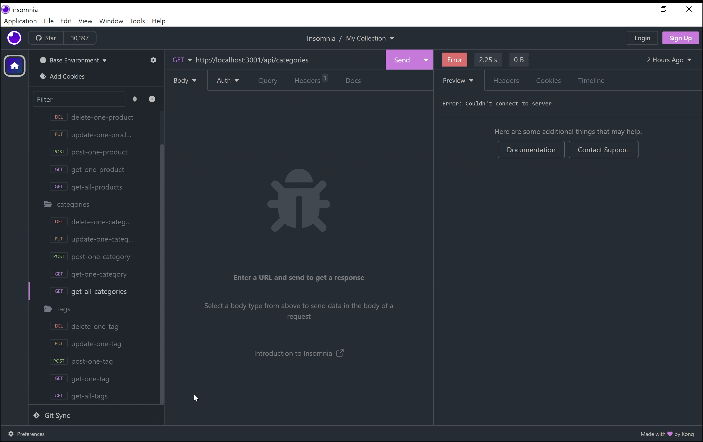

[](#license)


# Online Market

## _Description_

This repository has a web application that uses
[Node.js](https://nodejs.org/en) along with the `express` and `sequelize` packages in order to provide an e-commerce back-end for the client. It has multiple valid JS (ES6) files and SQL files; the `server.js` file contains the `sync()` method from sequelize for running the application, and the `schema.sql` file contains the setup for the SQL database.

- [Node.js](https://www.npmjs.com/package/sequelize) External Command Line Interface Module `sequelize`, used to connect to the database, close the connection, test if the connection works, all while logging to the console every SQL query it performs.


## _Table of Contents_

-  [Description](#description)
-  [Installation Instructions](#installation)
-  [Usage Information](#usage-information)
-  [Test Instructions](#testing)
-  [Contributions Guidelines](#contributing)
-  [Credits](#credits)
-  [Workflow Video](#workflow-video)
-  [License](#license)
-  [Questions](#questions)

## _Installation_

```bash
git clone https://github.com/ktortolini/online-market.git
cd online-market
npm install
```

The client should make sure to use `source` within their own MySQL server (after logging in with their credentials) to set up the initial database contained in `schema.sql`.

## _Usage Information_

After the client clones the repository, changes to the appropriate directory and
makes sure they have the appropriate dependencies, they may type the following
in the terminal:

```bash
npm start
```

or

```bash
npm run watch
```

The client will be presented with a notification that the port has been opened indicating that the application has started and is running.



To organize the store-front there are various classes that exist like `Category`, `Product`, `ProductTag`, and `Tag` for storing the merchandise. For example, the `Category` model was written in `JS`, according to the provided instructions, with the following code snippet:

```js
// defines the 'id' and 'category_name' columns
id: {
	type: DataTypes.INTEGER,
	allowNull: false,
	primaryKey: true,
	autoIncrement: true,
},
category_name: {
	type: DataTypes.STRING,
	allowNull: false,
},
```

Then there are various routes for CRUD operations like Create, Read, Update, and Delete when handling the merchandise. For example, if the client wants to create a new tag for their products, they may use the `Tag` model and call the post route, which is written in `JS` with the following code snippet:

```js
// creates an async post route to await the create() method
router.post('/', async (req, res) => {
	// starts a try ... catch block
	try {
	// creates a variable to store the result of create() method
		const tagData = await Tag.create(req.body);
		res.status(200).json(tagData);
	} catch (err) {
	// responds with a status code 500 if there is an error
		res.status(500).json(err);
	}
});
```

This summarizes the general functionality of this application, but there are some more details provided in the workflow video below. Any client would be able to use this enjoyable back-end and exciting application for their e-commerce needs. Looking forward to the next challenge. 🤓📝

## _Testing_

There are no testing guidelines for this project.

## _Contributing_

There are no contribution guidelines for this project.

## _Credits_

First, the EDX readme file icon on the top was made by
[Ileriayo](https://github.com/Ileriayo) with a link provided below:
https://github.com/Ileriayo/markdown-badges#badges.

Lastly, parts of the `HTML`, `CSS`, and `JS` code were created with knowledge gained through EDX, as part of their comprehensive Full Stack Web Development online program. In addition, I made use of tutoring available through the same program, working with Andrew Hardemon to fix and double check the routes. To learn about the online program from EDX visit the link here: https://www.edx.org/learn/full-stack-development.

## _Workflow Video_

The workflow video is available on [YouTube](https://youtu.be/wi-FaM199IM).

## _License_

Persistent Notes is licensed under an MIT License.

## _Questions_

Contact the author [ktortolini](https://github.com/ktortolini) via email ✉ <a>ktortolini@smu.edu</a>.
